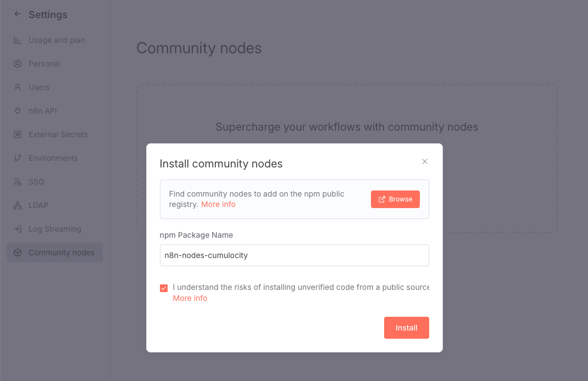

# n8n-nodes-cumulocity

[](https://www.npmjs.com/package/n8n-nodes-cumulocity)
[](LICENSE.md)

An [n8n](https://n8n.io/) community node for [Cumulocity](https://www.cumulocity.com/). It lets you automate IoT workflows (devices, measurements, alarms, events, operations and more) using the Cumulocity REST API, without writing HTTP requests by hand. It also works as a tool for n8n AI Agents.

## Node descriptions

- **Standard n8n workflows:** A high-performance IoT integration node for Cumulocity REST APIs. Use it to automate device provisioning, stream time-series sensor telemetry, trigger system alarms, log audit events, bind hardware identity mappings, issue control operations, and manage asset hierarchies natively within n8n canvas workflows.

- **n8n AI & multi-agent workflows:** An AI-native tool node designed for the n8n AI Agent Orchestrator and specialized sub-agents. Features pre-execution IIFE validation guards that catch missing parameters before network execution, structured tool schema signatures via `$fromAI()`, and dynamic JSON fragment injection to support LLM-driven IoT orchestration.

## Key features

- **Inventory management:** Provision devices, create managed objects, and query inventory by ID, name or type.
- **Measurements:** Ingest time-series sensor data (water flow, temperature, pressure, power, etc.) with automatic ISO 8601 formatting (`{{ $now.toISO() }}`).
- **Alarms:** Raise, query by device or severity level, acknowledge, clear, and update alarm status and severity by ID.
- **Events:** Log operational, audit and historical events, query recorded device event histories, and delete event records.
- **Identity management:** Bind hardware identifiers (serials, IMEIs, MAC addresses) to internal Cumulocity device IDs.
- **Operations:** Dispatch remote device control operations (`c8y_Restart`, `c8y_Configuration`, shell commands) and track execution states.
- **Asset hierarchies:** Model complex parent-child asset structures and assign child devices to groups.
- **Multi-agent safeguards:** Built-in IIFE validation guards throw immediate `VALIDATION_ERROR` responses before network execution if required parameters are missing.

## Installation

Follow the [n8n community nodes installation guide](https://docs.n8n.io/integrations/community-nodes/installation/gui-install/), or use these steps:

1. In n8n, go to **Settings > Community nodes**.
2. Select **Install a community node**.
3. Enter the npm package name: `n8n-nodes-cumulocity`
4. Tick **I understand the risks of installing unverified code from a public source**.
5. Select **Install**.



After installation, search for **Cumulocity** in the node panel of your workflow canvas.

## Credentials

You need a Cumulocity user with permissions for the APIs you want to use.

1. Open a Cumulocity node and select **Create new credential**.
2. Choose **Cumulocity API** and fill in:

| Field | Description | Example |
| --- | --- | --- |
| **Domain / Host** | URL of your Cumulocity tenant | `https://mytenant.cumulocity.com` |
| **Tenant ID** | Your tenant ID | `t12345678` |
| **Username** | Cumulocity username | `jane.doe@example.com` |
| **Password** | Cumulocity password | |

3. Select **Save**. n8n tests the connection against `/user/currentUser` and shows **Connection tested successfully** when the credentials work.

## Resources & operations

| Resource | What you can do |
| --- | --- |
| **Inventory** | Create devices and managed objects; get by ID, name or type; list devices |
| **Measurement** | Ingest time-series data; query by source, type or fragment type; delete by ID |
| **Alarm** | Raise alarms; query by ID, source, fragment type, severity or status; update status or severity; delete by ID |
| **Event** | Create events; query by ID or source; delete by ID |
| **Operation** | Send device control operations (for example `c8y_Restart`, `c8y_Configuration`); query by ID or device; update status |
| **Identity** | Bind external IDs (serial, IMEI, MAC address) to devices; look up, list and delete external IDs |
| **Asset** | Assign and unassign child devices and assets; list child devices |

List operations support pagination.

**Tip:** for measurement and event timestamps, use the expression `{{ $now.toISO() }}` to get a valid ISO 8601 value.

## Using with AI Agents

This node is engineered to plug directly into an **AI Agent Orchestrator** in n8n. Sub-agents can invoke specific resources and operations using `$fromAI()` tool parameters. The node can be used as a tool by the n8n **AI Agent** node. Parameters can be filled by the model with `$fromAI()`, and required parameters are validated before any request is sent. If one is missing, the node returns a `VALIDATION_ERROR` so the agent can correct itself instead of making a failing API call.

A common setup is one sub-agent per resource:

| Sub-agent | Resource | Operations |
| --- | --- | --- |
| Inventory | `inventory` | `createDevice`, `createManagedObject`, `getById`, `getByName`, `getByType`, `getDevices` |
| Measurement | `measurement` | `createMeasurement`, `getBySource`, `getByType`, `getByFragmentType`, `deleteById` |
| Alarm | `alarm` | `createAlarm`, `getById`, `getBySource`, `getByFragmentType`, `getBySeverity`, `getByStatus`, `updateStatus`, `updateSeverity`, `deleteById` |
| Event | `event` | `createEvent`, `getById`, `getBySource`, `deleteById` |
| Operation | `operation` | `createOperation`, `getById`, `getByDevice`, `updateStatusById` |
| Identity | `identity` | `createExternalId`, `getExternalId`, `getAllExternalIds`, `deleteExternalId` |
| Asset | `asset` | `assignChildDevice`, `assignChildAsset`, `getChildDevices`, `unassignChildDevice` |

To use the node as an AI tool on self-hosted n8n, set `N8N_COMMUNITY_PACKAGES_ALLOW_TOOL_USAGE=true`.

## Compatibility

- Tested with n8n 1.x.
- Requires access to a Cumulocity tenant with the REST API enabled.

## Development

### Prerequisites

- **Node.js** (v18 or v20 recommended)
- **npm** (v9+)
- **Docker** (for local n8n testing)

### 1. Clone & install dependencies

```bash
git clone https://github.com/Cumulocity-IoT/n8n-nodes-cumulocity.git
cd n8n-nodes-cumulocity
npm install
```

### 2. Build the extension

Compile the TypeScript definitions and copy the SVG icons to the `dist/` build directory:

```bash
npm run build
```

### 3. Deployment & Docker integration

To deploy and test your compiled node in a local n8n Docker setup, sync the build output directly to your n8n custom node directory and restart the container:

```bash
# 1. Compile TypeScript and build assets
npm run build

# 2. Sync node package into your n8n Docker custom node_modules folder
rsync -av --exclude 'node_modules' ./ /path/to/n8n/docker/custom/node_modules/n8n-nodes-cumulocity/

# 3. Restart n8n Docker container
docker restart <YOUR_CONTAINER_ID_OR_NAME>
```

> **Note:** After restarting Docker, perform a hard refresh in your browser (**Cmd + Shift + R** or **Ctrl + F5**) and re-add the node onto the n8n canvas to ensure the web UI loads the latest schema definitions.

## Contributing

Contributions are welcome. If you have a fix, a new resource or operation, or a documentation improvement:

1. Fork the repository and create a branch for your change.
2. Make your changes and check that `npm run build` succeeds.
3. Open a pull request describing what you changed and why.

For larger changes, please open an issue first so we can discuss the approach. We will do our best to review pull requests promptly. Bug reports and feature requests are also welcome in the [issue tracker](https://github.com/Cumulocity-IoT/n8n-nodes-cumulocity/issues).

## Resources

- [n8n community nodes documentation](https://docs.n8n.io/integrations/community-nodes/)
- [Cumulocity REST API reference](https://cumulocity.com/api/core/)
- [Cumulocity documentation](https://cumulocity.com/docs/)
- [Report an issue](https://github.com/Cumulocity-IoT/n8n-nodes-cumulocity/issues)

## License

[MIT](LICENSE.md)
